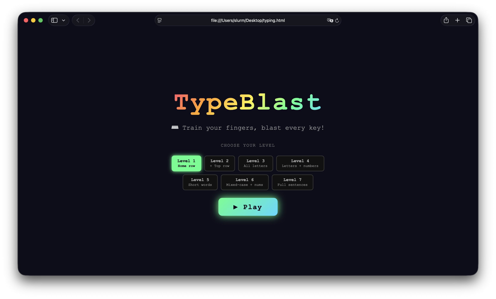

# Browser Kids Games
A collection of simple educational games for kids built using **pure HTML and JavaScript**.

No frameworks.  
No installation.  
No build tools.

Just open the file and play.

This project aims to create **fun, educational games that run anywhere a web browser exists**, perfect for schools, offline computers, and beginners learning programming.

## How it works:
1. Choose a game and download it.
2. Double click the file.
The game should open a web browser and start working.

## The games:
| Game        | Description                  | Play                   |
|-------------|------------------------------|------------------------|
| Typing Game | Learn keyboard typing skills | [Open](TypeBlast.html) |

## How to Add a New Game
1. Create a new `.html` file.
2. Use only **vanilla HTML, CSS, and JavaScript**.
3. The game must run directly in the browser.
4. No external dependencies.
5. Add the game to the games table in README.
**NOTE:** send me a pull request if you find and patch any bugs.

## TODO
- [ ] Addition game
- [ ] Subtraction game
- [ ] Multiplication practice
- [ ] Division practice
- [ ] Fractions game
- [ ] Memory card game
- [ ] Spelling game
- [ ] Geography quiz  
